# Analysis of RNA-seq data generated by biostate.ai from hippocampi of *Mov10* Deletion and WT mice at P0, P7, P14, and P23. 

## 1. Introduction / Collaboration Context
In June 2024, I was contacted by academic collaboration coordinator Jessie Yang, representing the startup [biostate.ai](https://biostate.ai/), asking if our lab would be interested in collaborating with their company. During a meeting with co-founder and CEO Dr. David Zhang and Jessie, we agreed to pursue a collaborative project in which I would supply hippocampi from WT mice and our new mouse model called *Mov10* Deletion (DEL), which shows enlarged cortical thickness, increased dendritic arborization, and enhanced fear memory. The samples were to be collected at postnatal day 0 (P0), P7, P14, and P23 (I initially considered embryonic day 16, but dropped this timepoint due to the inability to determine the exact day of conception). Biostate.ai would then isolate mRNAs and sequence them using their patented approach. By October 2024, I had collected and cryopreserved all the samples (3 biological replicates per timepoint, with hippocampi from at least 2 mice per sample). The sequencing was completed by February 2025, but I was preoccupied with publishing my first-author paper, learning patch-clamping, and working with MRI, so I did not analyze the data until recently.

In addition to the 24 sequencing samples (3 replicates * 4 timepoints * 2 genotypes), I decided to incorporate previously generated [data](https://link.springer.com/article/10.1186/s12915-025-02138-6) as well. The main challenge with this approach was correcting for batch effects and differences in library size between the two datasets. The previously generated data had ~80 million reads per sample, RNA was isolated from fresh tissue, and sequencing was performed at the Roy J. Carver Biotechnology Center, University of Illinois at Urbana-Champaign. In contrast, the biostate.ai data had ~10 million reads per sample, RNA was isolated from cryopreserved tissue, and sequencing was performed by the company.

---

## 2. Preprocessing and Quantification
I removed the adapters that were provided to me by biostate.ai using `cutadapt` (v3.7) and then used Selective Alignment method of `Salmon` (v1.10.0) with a decoy-aware transcriptome using the entire GRCm39 genome (vM37) as the decoy to estimate expression level of each transcript. The MultiQC report did not raise any concerns.

---

## 3. Differential Expression Analysis

### 3.1 edgeR Pipeline
I started my analysis using the default `edgeR` (v4.6.3) pipeline. The PCA plot showed that the primary component explaining variability between samples was the timepoint. Technical replicates explained the second-largest component, suggesting that differences between genotypes were relatively small. However, the percentages of explained variance were low — only 19% and 2%.

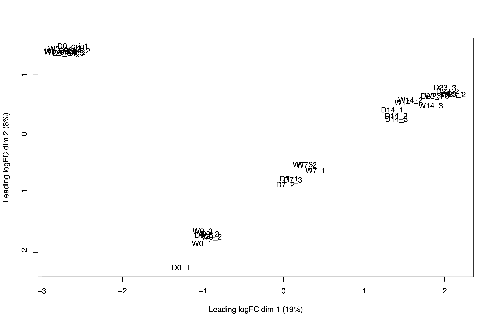

For differential expression (DE) analysis, I included batch, genotype, and timepoint as main effects and added the interaction term between genotype and timepoint. The DE results were very conservative — after FDR correction, the number of differentially expressed genes (DEGs) was 42, 6, 9, and 0 for P0, P7, P14, and P23 (DEL vs WT), respectively.

---

### 3.2 Batch Correction and Surrogate Variables
I then tried correcting for batch effect and library size using surrogate variables and the `ComBat_seq` function from the `sva` (v3.56.0) R package. The PCA plot for `ComBat_seq` looked promising: compared to the default `edgeR` pipeline, P0 samples clustered together. The top two components explaining variability, however, remained unchanged. 

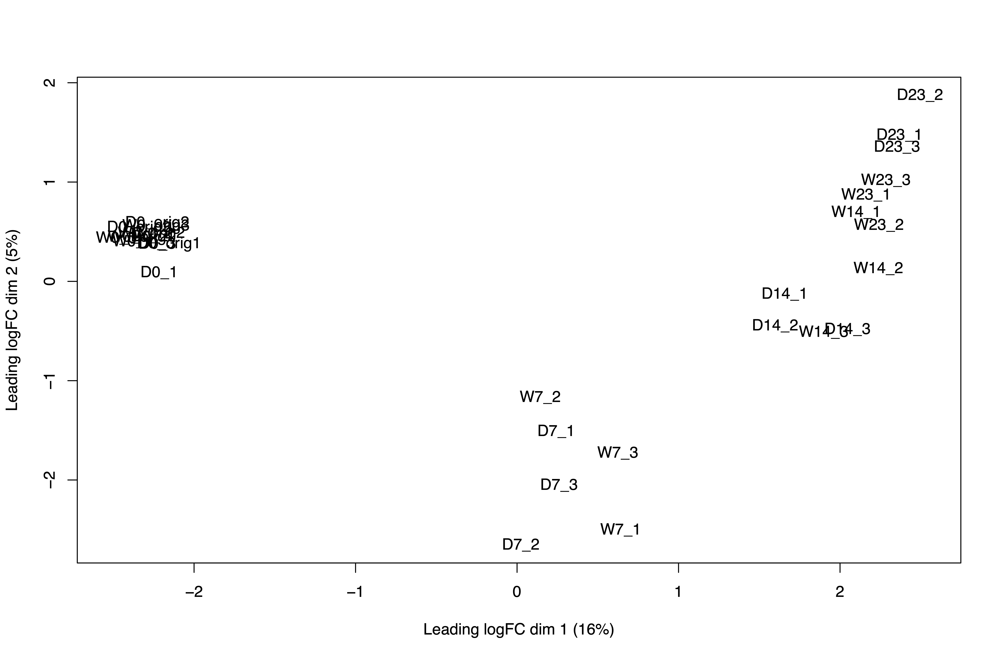

Based on the large range of BCV values and high dispersion in the QLDisp plot, `ComBat_seq` actually performed worse than the default `edgeR` pipeline. On the other hand, tighter BCV and QLDisp distributions when using surrogate variables suggested they improved the default model.  

| edgeR | sva | ComBat_seq |
|-------|-----|------------|
| 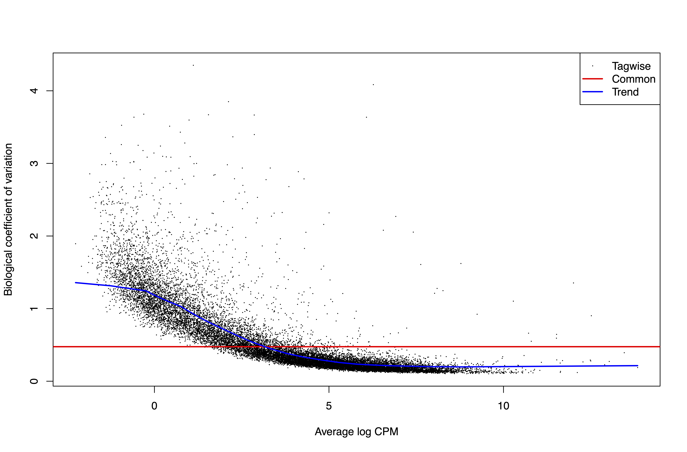 | 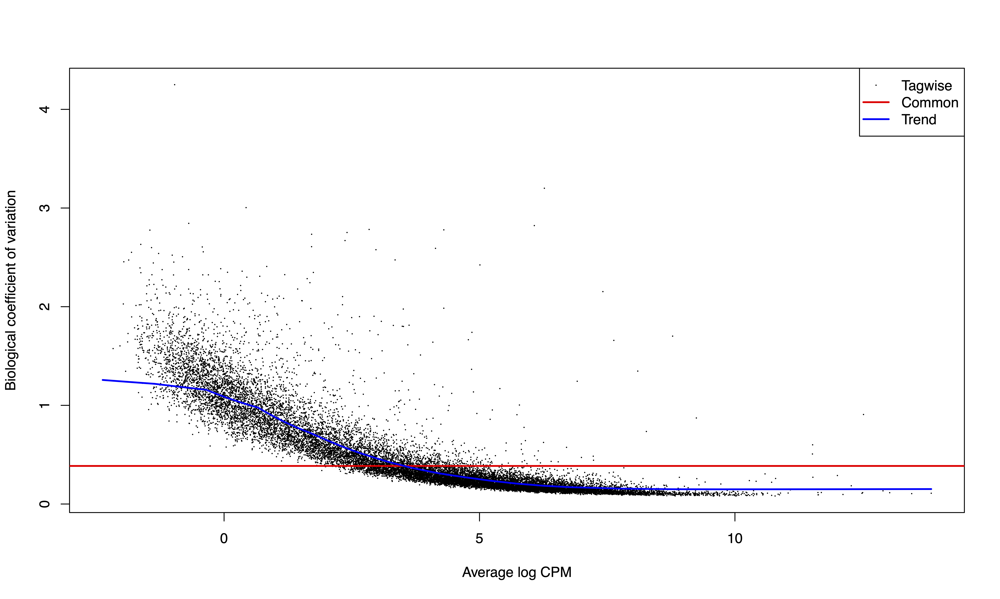 | 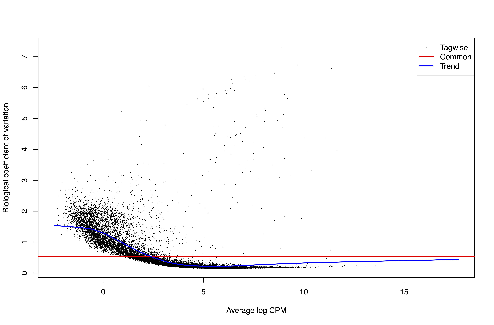 |
|  | 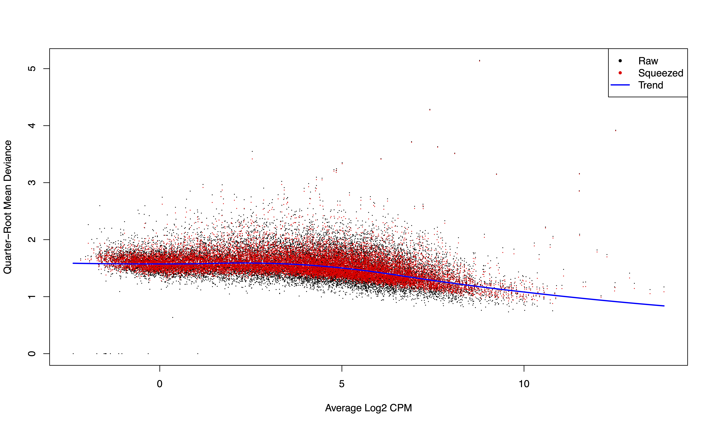 | 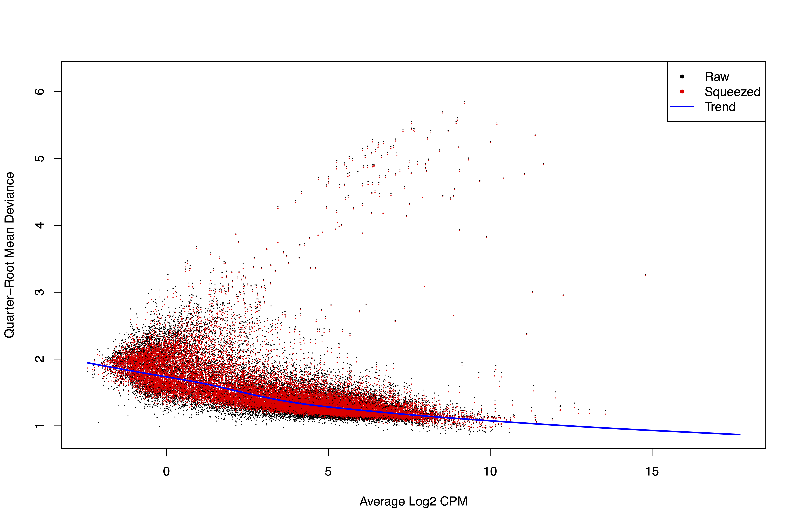 |

This conclusion was supported by DEG counts.

| Method     | P0    | P7 | P14 | P23 |
|------------|-------|----|-----|-----|
| edgeR      | 46    | 6  | 9   | 0   |
| sva        | 32    | 3  | 12  | 1   |
| ComBat_seq | 18616 | 41 | 13  | 10  |

Although the surrogate variables increased the number of DEGs, the results were skewed toward earlier timepoints. `ComBat_seq`, on the other hand, clearly introduced artifacts, since all expressed genes at P0 were called significant.

---

### 3.3 DESeq2 Pipeline
I then tried another package, `DESeq2` (v1.48.1). The PCA plot results were similar to `edgeR`, separating samples by timepoint and technical replicate. 

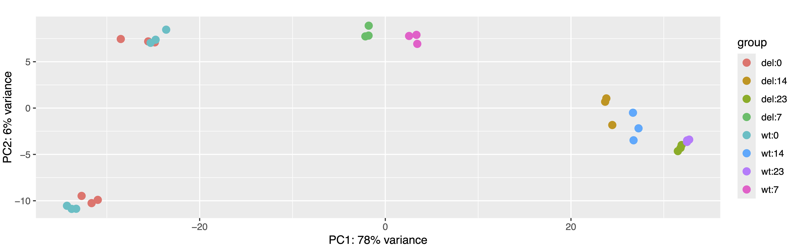

However, the proportion of variability explained by timepoint was much higher (78% vs 19%). While P0 samples from the two batches did not fully cluster, `DESeq2` placed them closer together than `edgeR`. Again, I modeled batch, genotype, and timepoint as main effects and included the genotype * timepoint interaction. DE analysis gave 40, 38, 31, and 36 DEGs for P0, P7, P14, and P23, respectively. Interestingly, *Mov10* itself was not among the DEGs, although it was consistently downregulated based on logFC.

---

### 3.4 RUVseq Adjustment
My final attempt to address batch effects used the `RUVseq` (v1.42.0) R package. I generated two surrogate variables, and the first appeared to clearly capture batch and library size differences. 

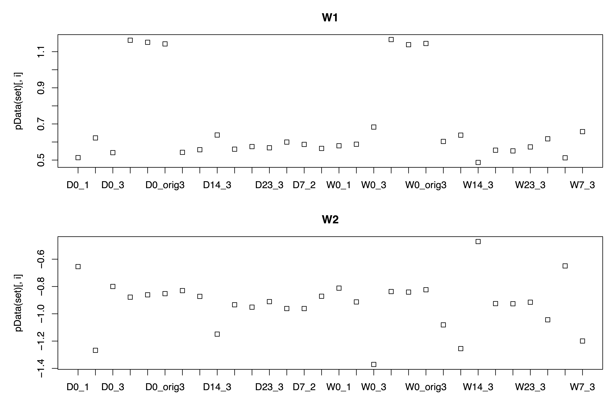

I therefore included it in the model while removing batch to avoid overfitting. The number of DEGs did not change substantially — 31, 42, 29, and 43 at the four timepoints — and the sets of DEGs overlapped considerably, as shown in the Venn diagrams below. 

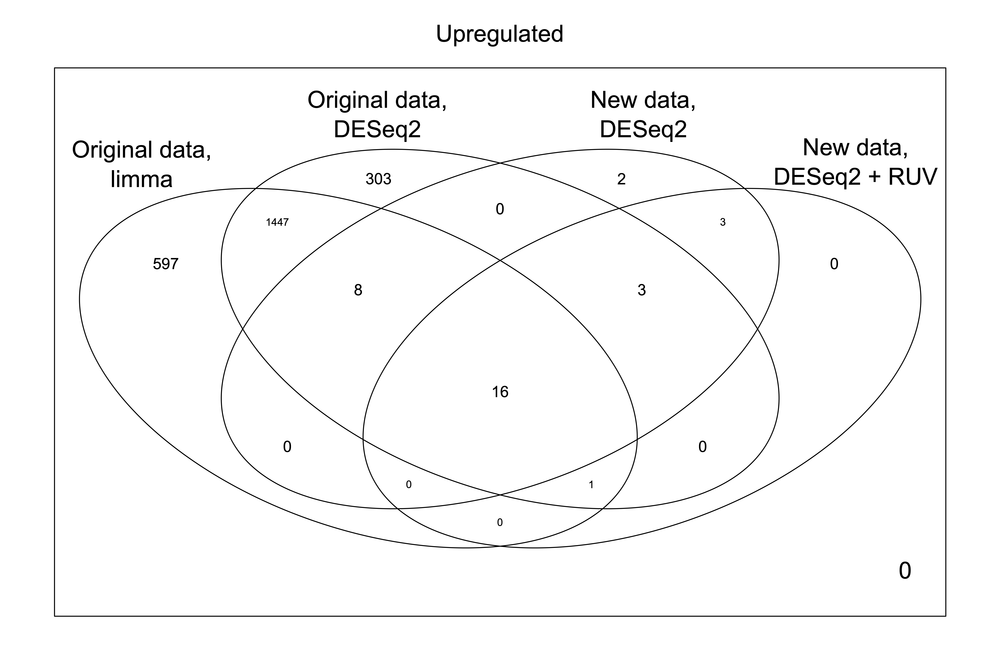

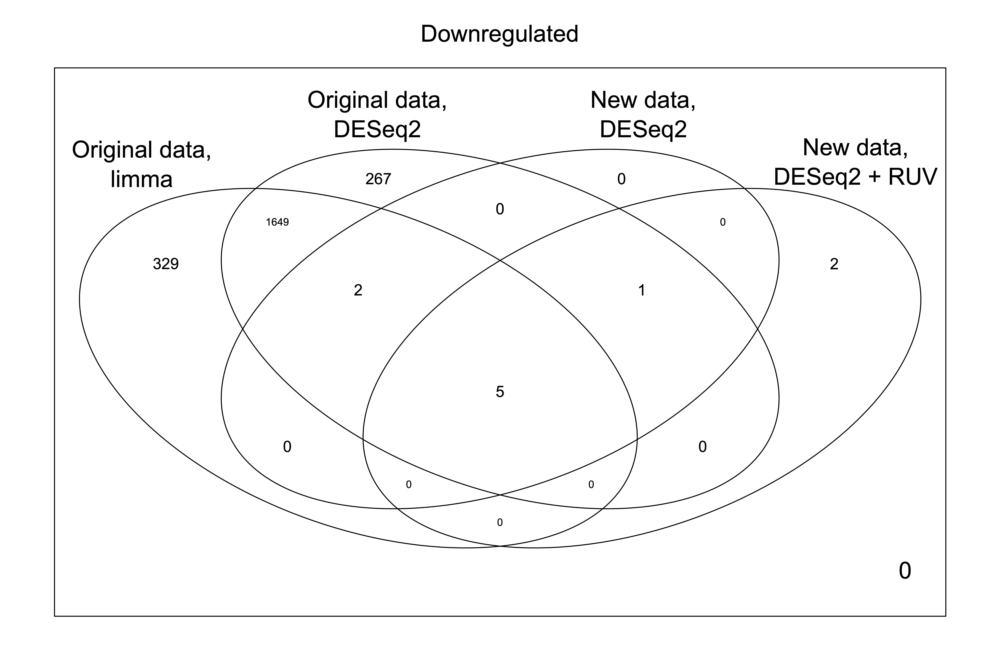

I was pleased to see strong overlap between DEGs from my original analysis, the reanalysis of the original dataset using `DESeq2`, and the analysis of the new dataset. The lower overall number of DEGs was likely due to the ~10x lower sequencing depth. In the end, I chose to use the results from the default `DESeq2` pipeline for publication, as they were clear and yielded a reasonable number of DEGs. I also attempted functional enrichment analysis using gene ontology (GO), but the number of DEGs was too low; instead, I annotated genes using [`Panther.db`](https://pantherdb.org/).

---

## 4. Clustering Analysis
Next, I clustered all genes that passed filtering across all samples. Based on the cluster dendogram, I decided to use `k=5` to cut the tree.

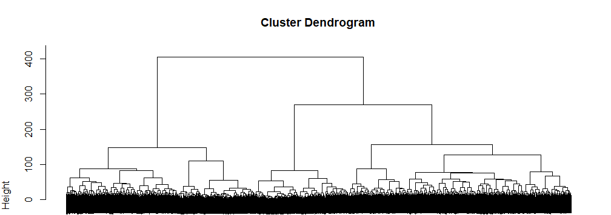

An interesting observation was that DEL and WT samples showed very similar expression patterns, consistent with the PCA results.

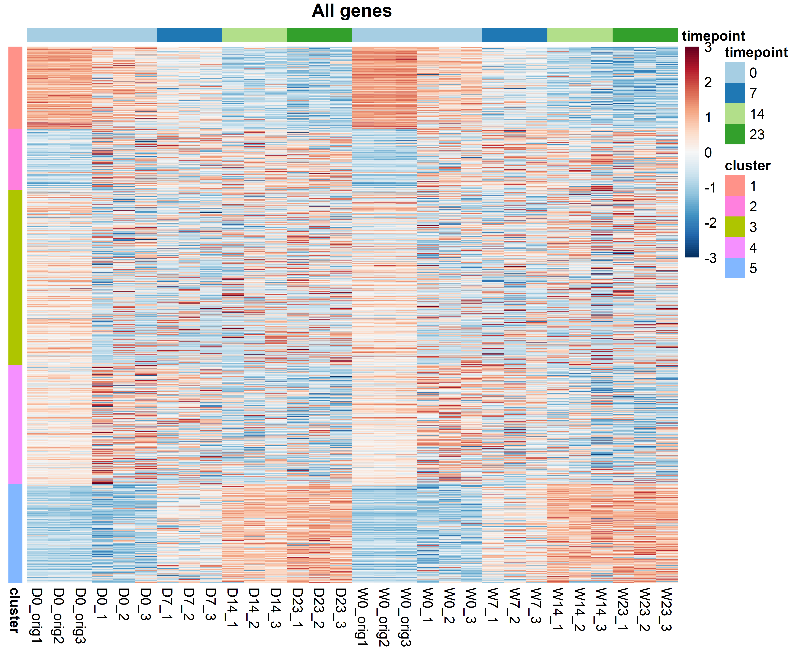

### 4.1 Cluster Dynamics

The clusters themselves revealed distinct dynamics:

- **Cluster 1** and **Cluster 4** contained genes highly expressed at early timepoints that decreased with development (**Cluster 1** showing sharper changes).
- **Cluster 5** showed the opposite pattern, with low expression at P0, moderate at P7, and high at P14 and P23.
- **Cluster 3** contained genes with moderate expression across all timepoints.
- **Cluster 2** included genes most affected by batch differences — they had low expression in the original dataset but moderate to high expression in the new dataset.

### 4.2 Functional Enrichment
Finally, I performed functional enrichment analysis on each cluster using `Panther.db` GO and obtained several interesting results:

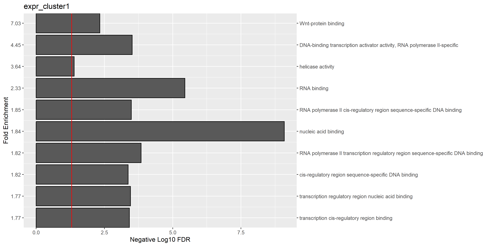

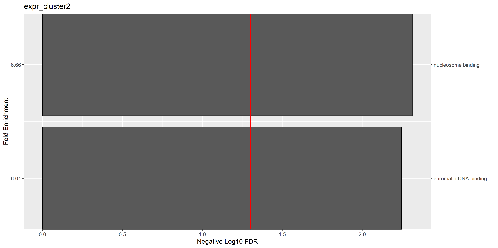

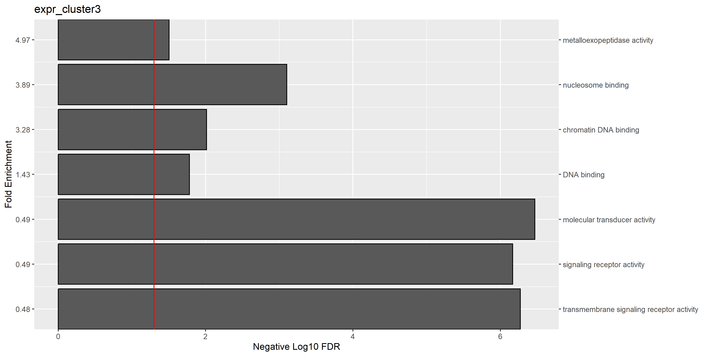

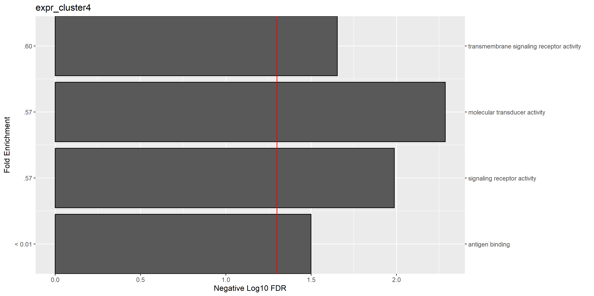

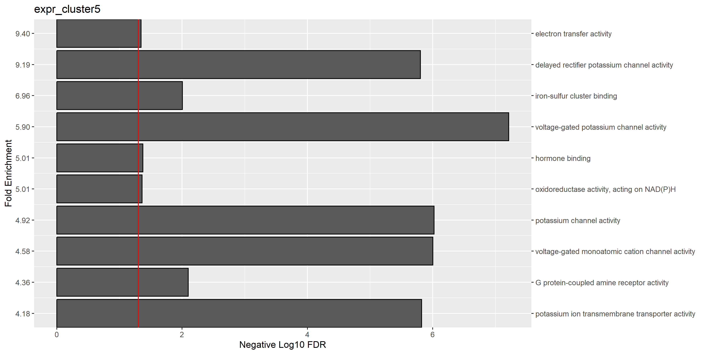

---

## 5. Data Availability
- The original dataset is available at [GSE232771](https://www.ncbi.nlm.nih.gov/geo/query/acc.cgi?acc=GSE232771).
- New dataset will be available after it’s published. 
