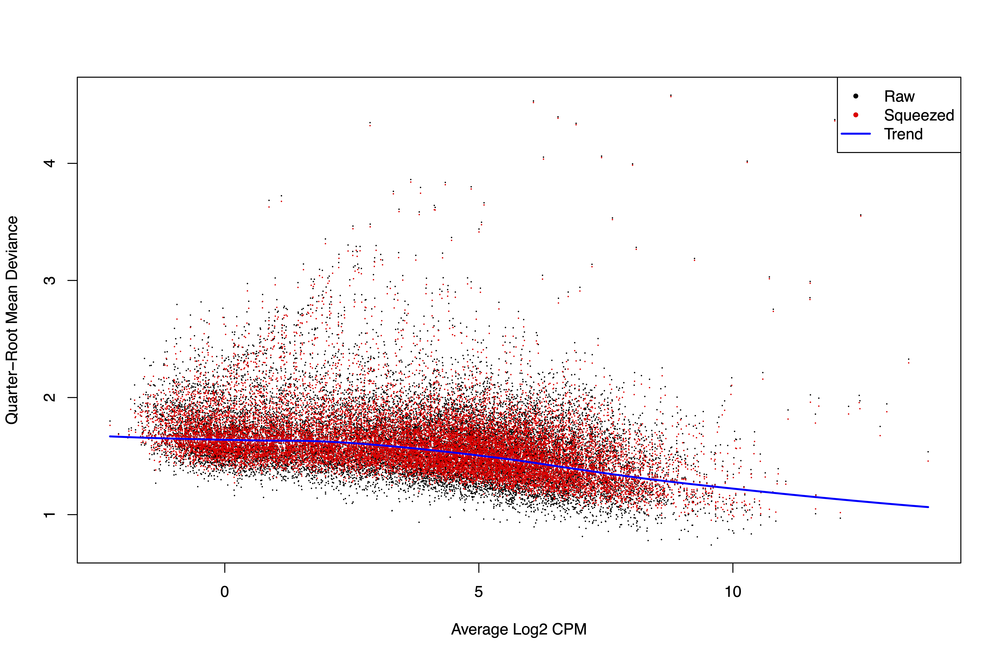

# RNA-seq Analysis of *Mov10* Deletion and WT Mice

## 1. Introduction / Collaboration Context
In June 2024, I was contacted by academic collaboration coordinator Jessie Yang, representing the startup [biostate.ai](https://biostate.ai/), asking if our lab would be interested in collaborating with their company. During a meeting with co-founder and CEO Dr. David Zhang and Jessie, we agreed to pursue a collaborative project in which I would supply hippocampi from WT mice and from our new mouse model, called *Mov10* Deletion (DEL), which shows enlarged cortical thickness, increased dendritic arborization, and enhanced fear memory.

The samples were collected at postnatal day 0 (P0), P7, P14, and P21 (embryonic day 16 was initially considered but dropped due to uncertainty in determining the exact day of conception). Biostate.ai isolated mRNAs and sequenced them using their patented approach. By October 2024, all samples were collected and cryopreserved (3 biological replicates per timepoint, with hippocampi from at least 2 mice per sample). The sequencing was completed by February 2025.

In addition to the 24 sequencing samples (3 replicates × 4 timepoints × 2 genotypes), previously generated [data](https://link.springer.com/article/10.1186/s12915-025-02138-6) was incorporated. The main challenge was correcting for batch effects and differences in library size between datasets.

---

## 2. Preprocessing and Quantification
Adapters provided by biostate.ai were removed using `cutadapt` (v3.7). Expression levels were estimated using the Selective Alignment method of `Salmon` (v1.10.0) with a decoy-aware transcriptome using the entire GRCm39 genome (vM37). The MultiQC report did not raise any concerns.

---

## 3. Differential Expression Analysis

### 3.1 edgeR Pipeline
The initial analysis used the default `edgeR` (v4.6.3) pipeline. The PCA plot showed that the primary component explaining variability between samples was the timepoint, while technical replicates explained the second-largest component. Percentages of explained variance were low — 19% and 2%.  

DE analysis included batch, genotype, and timepoint as main effects and the genotype × timepoint interaction. After FDR correction, DEGs were 42, 6, 9, and 0 for P0, P7, P14, and P23 (DEL vs WT).

---

### 3.2 Batch Correction and Surrogate Variables
Batch and library size were corrected using surrogate variables and the `ComBat_seq` function from the `sva` (v3.56.0) R package. PCA plots for `ComBat_seq` showed P0 samples clustering together.  

BCV and QLDisp plots revealed that `ComBat_seq` performed worse than default `edgeR`, while surrogate variables improved the model:  

| edgeR | sva | ComBat_seq |
|-------|-----|------------|
|  |  |  |
|  |  |  |

DEG counts:

| Method     | P0    | P7 | P14 | P23 |
|------------|-------|----|-----|-----|
| edgeR      | 46    | 6  | 9   | 0   |
| sva        | 32    | 3  | 12  | 1   |
| ComBat_seq | 18616 | 41 | 13  | 10  |

---

### 3.3 DESeq2 Pipeline
`DESeq2` (v1.48.1) PCA showed similar patterns but with 78% variance explained by timepoint. P0 samples from two batches were closer than with `edgeR`. DE analysis returned 40, 38, 31, and 36 DEGs for P0, P7, P14, and P23, respectively. *Mov10* itself was consistently downregulated but not called as DEG.  

---

### 3.4 RUVseq Adjustment
`RUVseq` (v1.42.0) generated surrogate variables; the first variable captured batch and library differences. Batch was removed to avoid overfitting. DEG counts after RUVseq: 31, 42, 29, 43.  

Venn diagrams of overlaps:  

---

## 4. Clustering Analysis
All filtered genes were clustered (k=5 based on dendrogram):

Expression patterns for all genes:

### 4.1 Cluster Dynamics
- **Cluster 1** and **Cluster 4**: highly expressed at early timepoints, decreasing with development (**Cluster 1** shows sharper changes).  
- **Cluster 5**: low at P0, moderate at P7, high at P14 and P23.  
- **Cluster 3**: moderate across all timepoints.  
- **Cluster 2**: most affected by batch differences — low in original dataset, moderate-high in new dataset.  

### 4.2 Functional Enrichment
Functional enrichment for each cluster using Panther.db GO revealed several interesting patterns:

---

## 5. Data Availability
- Original dataset: [GSE232771](https://www.ncbi.nlm.nih.gov/geo/query/acc.cgi?acc=GSE232771)  
- New dataset: will be available after publication.